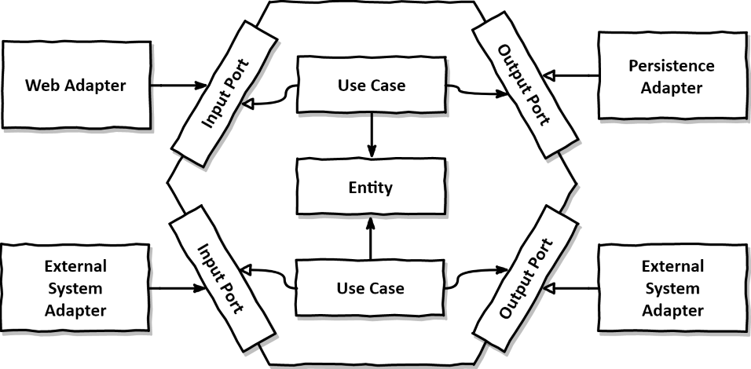
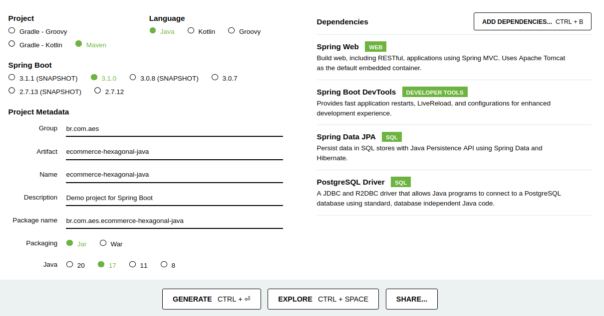

# Projeto: Ecommerce

Criação do projeto Produtc API com java, spring boot e PostgresSQl

1. Instalando o banco de dados postgres
2. Criando o projeto no github
3. Criando o projeto com Spring Initializr
4. Configurações do projeto
5. Criação do domain
6. Criação do application
7. Criação da infrastructre

### Importância dos testes e do desenvolvimento orientado a teste:

Garantir que essa aplicação continuará funcionando mesmo com mudanças futuras no código.

Como garantir que a mudança de um local não irá impactar no restante da aplicação

# GitHub

New repository

Repository name: /ecommerce-hexagonal-java

    echo "# ecommerce-hexagonal-java" >> README.md
    git init
    git add README.md
    git commit -m "first commit"
    git branch -M main
    git remote add origin https://github.com/leonardorsolar/ecommerce-hexagonal-java.git
    git push -u origin main

# Configurações da aplicação

# Criando o projeto com Spring Initializr

Criando projeto java maven:
criar nosso projeto baseado no Spring Boot a partir do template do spring Initializr.

Baixe o código do Spring-Boot configurado

Acesse https://start.spring.io/
Maven
Spring Boot estável
group> br.com.aes
Artifact (nome do projeto): ecommerce-hexagonal-java
Packaging (linguagem java): jar versão: 17 (LTS)
Adicionar dependências:
Spring Web WEB Build web ( rest rota get...)
Spring Boot DevTools
Spring Data JPA SQL (banco de dados)
PostgreSQL Driver SQL (banco de dados na nuven) A JDBC and R2DBC driver that allows

cliquem em Generate Project

## Arquivo de Incialização:

Abra a pasta do projeto no vscode para baixar as dependências

Vá até o arquivo: src/main/java/br/com/aes/simpledb/SimpleDbApplication.java

Com o projeto criado, vá no vscode e abra a pasta que acabamos de criar. O vscode irá tentar inicializar as extensões, e atualizar as dependências Maven. Então, aguarde até que o processo termine antes de continuar:

-> Ver as atualizações no menu inferior do vscode

As dependências ficam no arquivo pow.xml
opicional: pode-se comentar as dependências seguir, pois não usaremos agora. Toda a hora que o projeto iniciar vai configurra o acesso ao banco de dados.
Spring Data JPA SQL (banco de dados)
PostgreSQL Driver SQL

Comentar as dependências que não utilizaremos agora:

jpa e postgresql

Caso não comente dará um erro pois não configuramos ainda o acesso ao banco de dados.

## Estruturas da pastas

A estrutura de pastas/grupos do projeto assume a seguinte forma:

    ├── aplication
    ├── domain
    └── infrastructure

## Arquivo de configurações: application.properties

src/main/resources/application.properties

opicional: configurações para mudar o local host:

Arquivo resources:

application.properties:

    spring.profiles.active = dev

application-dev.properties:

    server.port = 9090

## BANCO DE DADOS: configurando o postgres na aplicação

Realizar a configuração para conexão

Configuraçẽos do banco de dados de teste:

application-test.properties

Configurando o MySQL em projetos Spring Boot

Após efetuar o download das dependências, vamos configurar as propriedades do PostgresSql e do JPA no projeto.

// Criar a conexão com banco de dados PstegresSql

    host: "localhost"
    user: "root"
    password: "root",
    database: "db-ecommerce-java"

application.properties :

Para isso edite o arquivo de configuração application.properties e adicione o seguinte conteúdo:

    spring.datasource.url = jdbc:postgresql://localhost:5432/db-ecommerce-java
    spring.datasource.username = root
    spring.datasource.password = root

    spring.jpa.hibernate.ddl-auto = update
    spring.jpa.sql-show = true
    spring.jpa.database-platform = org.hibernate.dialect.PostgreSQLDialect

## Configurando o mapstruct e lombok

        ...
        <properties>
            <java.version>17</java.version>
            <version.mapstruct>1.5.2.Final</version.mapstruct>
            <version.lombok>1.18.24 </version.lombok>
            <version.mapstruct-lombok>0.2.0 </version.mapstruct-lombok>
        </properties>
        ...
        <dependency>
    		<groupId>org.projectlombok</groupId>
    		<artifactId>lombok</artifactId>
    		<version>${version.lombok}</version>
    		<optional>true</optional>
    	</dependency>
    	<dependency>
    		<groupId>org.projectlombok</groupId>
    		<artifactId>lombok-mapstruct-binding</artifactId>
    		<version>${version.mapstruct-lombok}</version>
    	</dependency>
        ...
            <configuration>
    				<annotationProcessorPaths>
    					<path>
    						<groupId>org.mapstruct</groupId>
    						<artifactId>mapstruct-processor</artifactId>
    						<version>${version.mapstruct}</version>
    					</path>
    					<path>
    						<groupId>org.projectlombok </groupId>
    						<artifactId>lombok</artifactId>
    						<version>${version.lombok}</version>
    					</path>
    					<path>
    						<groupId>org.projectlombok </groupId>
    						<artifactId>lombok-mapstruct-binding</artifactId>
    						<version>${version.mapstruct-lombok}</version>
    					</path>
    				</annotationProcessorPaths>
    			</configuration>
                ...

## Compilação

Rodar o projeto para teste

run http://localhost:9090/

# Desenvolvimento da aplicação

        ├── aplication
        ├── domain
        └── infrastructure

# Camada Domain:

Criar as entidades para gestão dos produtos.

Criar uma classe de dominio para Product, User e enum UserType

## Camada Domain: UserType

package br.com.aes.ecommercehexagonaljava.domain;

    public enum UserType {
    ADMIN, USER
    }

Esse código em Java define uma enumeração chamada UserType que representa os diferentes tipos de usuário em um sistema. Uma enumeração é um tipo de dado especial que permite definir um conjunto fixo de valores constantes.

Isso significa que um objeto UserType só pode ser um dos dois tipos: administrador ou usuário comum.

Essa enumeração pode ser usada, por exemplo, para definir o tipo de um usuário em um sistema de autenticação. Você poderia ter uma classe User com um atributo do tipo UserType, permitindo que você defina se um usuário é um administrador ou um usuário comum.

## Camada Domain: classe User

Iremos inicar pelo teste para criamos uma classe:

Instalar no vscode a extensão:

Test Runner for Java
clicar no icone becker e habilitar

Vericamos no arquivo pom.xml que já temos a dependência default instalada:

        <dependency>
    		<groupId>org.springframework.boot</groupId>
    		<artifactId>spring-boot-starter-test</artifactId>
    		<scope>test</scope>
    	</dependency>

### Test: classe User

Acessar:

src/test/java/br/com/aes/ecommercehexagonaljava

cria uma nova classe: UserTest

Para criar um teste para a **classe User** usando o Spring Boot no Java, você pode utilizar uma estrutura de teste como o JUnit. Abaixo está um exemplo de como criar um teste para a classe User:

        @SpringBootTest
        class UserTest {

        @Test
        public void testUserCreation() {
            // Criação de um usuário de exemplo
            User user = new User();
            user.setId(1);
            // user.setUsername("john.doe");

            // Verificação dos valores definidos
            Assertions.assertEquals(1, user.getId().intValue());

        }

        }

    Par compilar: clicar no play ao lado da classe

    ou
    a extensão Test Runner for Java

Código da classe User:

import org.junit.jupiter.api.Assertions;
import org.junit.jupiter.api.Test;

    public class UserTest {

        @Test
        public void testUserCreation() {
            // Criação de um usuário de exemplo
            User user = new User();
            user.setId(1);
            user.setUsername("john.doe");
            user.setFirstName("John");
            user.setLastName("Doe");
            user.setEmail("john.doe@example.com");
            user.setAddress("123 Main St");
            user.setCellphone("555-1234");
            user.setPassword("password");
            user.setUserType(UserType.REGULAR);
            user.setDateCreated(LocalDateTime.now());

            // Verificação dos valores definidos
            Assertions.assertEquals(1, user.getId());
            Assertions.assertEquals("john.doe", user.getUsername());
            Assertions.assertEquals("John", user.getFirstName());
            Assertions.assertEquals("Doe", user.getLastName());
            Assertions.assertEquals("john.doe@example.com", user.getEmail());
            Assertions.assertEquals("123 Main St", user.getAddress());
            Assertions.assertEquals("555-1234", user.getCellphone());
            Assertions.assertEquals("password", user.getPassword());
            Assertions.assertEquals(UserType.REGULAR, user.getUserType());
            Assertions.assertNotNull(user.getDateCreated());
        }
    }

     o método testUserCreation() cria uma instância de User com valores específicos e, em seguida, verifica se os valores foram definidos corretamente usando asserções do JUnit. Certifique-se de ter as dependências adequadas do JUnit configuradas em seu projeto para executar o teste.

as anotações @Data, @AllArgsConstructor e @NoArgsConstructor do Lombok permitem que você crie uma classe User com getters, setters, construtores e outros métodos comuns sem precisar escrever todo o código manualmente. Isso ajuda a reduzir a quantidade de código boilerplate e simplifica a criação de classes de dados em Java.

        @Data
        @AllArgsConstructor
        @NoArgsConstructor
        public class User {
            private Integer id;
            private String username;
            private String firstName;
            private String lastName;
            private String email;
            private String address;
            private String cellphone;
            private String password;
            private UserType userType;
            private LocalDateTime dateCreated;

        }

Utiliza anotações do projeto Lombok para gerar automaticamente métodos comuns em uma classe Java, como getters, setters, construtores e métodos equals() e hashCode().

**@Data:** Essa anotação combina várias outras anotações do Lombok, como @Getter, @Setter, @ToString, @EqualsAndHashCode e @RequiredArgsConstructor. Ela gera automaticamente todos esses métodos comuns, facilitando a criação de classes de dados.

**@AllArgsConstructor:** Essa anotação gera um construtor que aceita todos os campos da classe como argumentos. Ele cria um construtor com parâmetros para todos os campos da classe, permitindo que você instancie um objeto User e defina todos os seus campos de uma só vez.

**@NoArgsConstructor:** Essa anotação gera um construtor sem argumentos. Ele cria um construtor vazio que não recebe nenhum parâmetro. Esse construtor pode ser útil em situações em que você precisa criar um objeto User sem fornecer nenhum valor inicial para os campos.

Código completo da classe User sem os anotations:

Como ficaria sem os anotations:

    public class User {
        private Integer id;
        private String username;
        private String firstName;
        private String lastName;
        private String email;
        private String address;
        private String cellphone;
        private String password;
        private UserType userType;
        private LocalDateTime dateCreated;

        public User() {
            // Construtor vazio
        }

        public User(Integer id, String username, String firstName, String lastName, String email, String address,
                    String cellphone, String password, UserType userType, LocalDateTime dateCreated) {
            this.id = id;
            this.username = username;
            this.firstName = firstName;
            this.lastName = lastName;
            this.email = email;
            this.address = address;
            this.cellphone = cellphone;
            this.password = password;
            this.userType = userType;
            this.dateCreated = dateCreated;
        }

        public Integer getId() {
            return id;
        }

        public void setId(Integer id) {
            this.id = id;
        }

        public String getUsername() {
            return username;
        }

        public void setUsername(String username) {
            this.username = username;
        }

        public String getFirstName() {
            return firstName;
        }

        public void setFirstName(String firstName) {
            this.firstName = firstName;
        }

        public String getLastName() {
            return lastName;
        }

        public void setLastName(String lastName) {
            this.lastName = lastName;
        }

        public String getEmail() {
            return email;
        }

        public void setEmail(String email) {
            this.email = email;
        }

        public String getAddress() {
            return address;
        }

        public void setAddress(String address) {
            this.address = address;
        }

        public String getCellphone() {
            return cellphone;
        }

        public void setCellphone(String cellphone) {
            this.cellphone = cellphone;
        }

        public String getPassword() {
            return password;
        }

        public void setPassword(String password) {
            this.password = password;
        }

        public UserType getUserType() {
            return userType;
        }

        public void setUserType(UserType userType) {
            this.userType = userType;
        }

        public LocalDateTime getDateCreated() {
            return dateCreated;
        }

        public void setDateCreated(LocalDateTime dateCreated) {
            this.dateCreated = dateCreated;
        }

        @Override
    public String toString() {
        return "User{" +
                "id=" + id +
                ", username='" + username + '\'' +
                ", firstName='" + firstName + '\'' +
                ", lastName='" + lastName + '\'' +
                ", email='" + email + '\'' +
                ", address='" + address + '\'' +
                ", cellphone='" + cellphone + '\'' +
                ", password='" + password + '\'' +
                ", userType=" + userType +
                ", dateCreated=" + dateCreated +
                '}';
    }

     @Override
    public int hashCode() {
        return Objects.hash(id, username, firstName, lastName, email, address, cellphone, password, userType, dateCreated);
    }

    @Override
    public boolean equals(Object o) {
        if (this == o) return true;
        if (o == null || getClass() != o.getClass()) return false;
        User user = (User) o;
        return Objects.equals(id, user.id) &&
                Objects.equals(username, user.username) &&
                Objects.equals(firstName, user.firstName) &&
                Objects.equals(lastName, user.lastName) &&
                Objects.equals(email, user.email) &&
                Objects.equals(address, user.address) &&
                Objects.equals(cellphone, user.cellphone) &&
                Objects.equals(password, user.password) &&
                userType == user.userType &&
                Objects.equals(dateCreated, user.dateCreated);
    }
    }

## Camada Domain: classe Product

@Data
@AllArgsConstructor
@ToString
public class Product {
private Integer id;
private String code;
private String name;
private String description;
private String image;
private BigDecimal price;

    private LocalDateTime dateCreated;
    private LocalDateTime dateUpdated;

    private User user;

    public Product() {
        this.setCode(UUID.randomUUID().toString());
    }

}

a classe Product representa um produto em um sistema. Ela possui campos que descrevem as características do produto, como id, code, name, description, image, price, dateCreated, dateUpdated e user.

A classe Product fornece métodos getters e setters para acessar e modificar os valores desses campos. Além disso, ela implementa automaticamente os métodos toString(), equals() e hashCode() por meio das anotações do Lombok.

O construtor vazio public Product() é usado para criar um objeto Product com um código único gerado aleatoriamente usando UUID.randomUUID().toString().

Em termos de funcionalidade, a classe Product fornece uma estrutura básica para representar um produto em um sistema, permitindo a definição e manipulação de suas informações, bem como a geração de uma representação em string do objeto por meio do método toString(). Ela pode ser utilizada como parte de um sistema maior que envolve gerenciamento de produtos, como armazenamento, exibição e manipulação de informações relacionadas a produtos.

# Camada Application: ProductRepository e ProductService

## Camada Application: classe ProductRepository (PORT)

Em uma arquitetura hexagonal, os ports representam as interfaces e os contratos que definem as operações e as capacidades do sistema. Eles são a parte externa da aplicação e fornecem uma maneira de interagir com o sistema a partir do mundo exterior.

a interface ProductRepository representa um port que define um contrato para acessar os dados de produtos. Ela é a parte externa da aplicação e define as operações disponíveis para interagir com os dados de produtos. As implementações concretas dessa interface são responsáveis por adaptar essas operações para o mecanismo de persistência específico.

    public interface ProductRepository {
    Iterable<Product> getProducts();
    Iterable<Product> getProductsByUser(User user);
    Product getProductById(Integer id);
    Product saveProduct(Product product);
    void deleteProductById(Integer id);
    }

A interface ProductRepository define um contrato para acessar e manipular dados relacionados a produtos.

Iterable<Product> getProducts(): Este método retorna uma coleção de objetos Product, representando todos os produtos disponíveis no repositório. A palavra-chave Iterable indica que a coleção pode ser percorrida usando um loop for-each ou outras estruturas de iteração.

Iterable<Product> getProductsByUser(User user): Este método retorna uma coleção de objetos Product que estão associados a um determinado usuário. Ele recebe um objeto User como parâmetro para identificar o usuário em questão. A implementação desse método pode buscar no repositório todos os produtos relacionados ao usuário fornecido.

Product getProductById(Integer id): Este método retorna um objeto Product com base em um ID específico. Ele recebe um valor inteiro (Integer) como parâmetro, representando o ID do produto desejado. A implementação desse método pode procurar no repositório o produto correspondente ao ID fornecido.

Product saveProduct(Product product): Este método salva um objeto Product no repositório. Ele recebe um objeto Product como parâmetro, representando o produto a ser salvo. A implementação desse método pode persistir o produto no banco de dados ou em outra forma de armazenamento e retornar o produto atualizado, incluindo o ID gerado.

void deleteProductById(Integer id): Este método exclui um produto com base em um ID específico. Ele recebe um valor inteiro (Integer) como parâmetro, representando o ID do produto a ser excluído. A implementação desse método pode procurar e remover o produto correspondente ao ID fornecido do repositório.

a interface ProductRepository atua como um port, definindo um conjunto de métodos que representam as operações básicas de acesso aos dados relacionados a produtos, como recuperar todos os produtos, recuperar produtos por usuário, recuperar um produto por ID, salvar um produto e excluir um produto por ID.

Essa interface serve como um contrato entre a camada de domínio (ou lógica de negócio) e a camada de infraestrutura (responsável pelo acesso aos dados). Ela permite que a camada de domínio defina suas necessidades e dependências de acesso aos dados sem se preocupar com a implementação concreta ou os detalhes técnicos de como os dados são armazenados.

Ao utilizar essa interface, é possível criar várias implementações diferentes, cada uma adaptando-se a um mecanismo de persistência específico, como banco de dados relacional, banco de dados NoSQL, serviço de terceiros, etc. Essas implementações são chamadas de adapters (adaptadores) e são responsáveis por fornecer a implementação concreta das operações definidas pelo port.

Em resumo, a interface ProductRepository define os métodos necessários para acessar e manipular dados de produtos, como obter todos os produtos, filtrar produtos por usuário, obter um produto por ID, salvar um produto e excluir um produto por ID. A implementação desses métodos pode variar dependendo do tipo de armazenamento de dados utilizado, como banco de dados, memória ou outro sistema de persistência.

## Camada Application: classe ProductService (PORT)

        public class ProductService {

        private final ProductRepository productRepository;

        public ProductService(ProductRepository productRepository) {
        this.productRepository = productRepository;
        }

        public Iterable<Product> getProducts(){
        return productRepository.getProducts();
        }

        public Iterable<Product> getProductsByUser(User user){
        return productRepository.getProductsByUser(user);
        }

        public Product getProductById(Integer id){
        return productRepository.getProductById(id);
        }

        public Product saveProduct(Product product){
        return productRepository.saveProduct(product);
        }

        public void deleteProductById(Integer id){
        productRepository.deleteProductById(id);
        }

        }

A classe ProductService é responsável por fornecer uma camada de serviço que utiliza o repositório de produtos (ProductRepository) para executar operações relacionadas a produtos.

A classe ProductService encapsula a lógica de negócio relacionada a produtos, utilizando o repositório de produtos para acessar e manipular os dados. Ela fornece métodos para obter todos os produtos, filtrar produtos por usuário, obter um produto por ID, salvar um produto e excluir um produto por ID. Essa separação de responsabilidades permite uma melhor organização e manutenção do código, além de facilitar a implementação de regras de negócio específicas relacionadas a produtos.

# Camada InfraStructure: UserEntity, ProductEntity, UserEntity com anotation JPA

## Camada InfraStructure: classe UserEntity

    @Entity
    @Table(name = "users")
    @Data
    @NoArgsConstructor
    public class UserEntity {
    @Id
    @GeneratedValue(strategy = GenerationType.IDENTITY)
    private Integer id;
    private String username;
    private String firstName;
    private String lastName;
    private String email;
    private String address;
    private String cellphone;
    private String password;
    @Enumerated(EnumType.STRING)
    private UserType userType;
    private LocalDateTime dateCreated;

    }

A classe UserEntity é uma entidade de banco de dados que representa um usuário. Vamos resumir o propósito de cada parte do código:

@Entity: Essa anotação indica que a classe UserEntity é uma entidade mapeada em um banco de dados. Ela está associada a uma tabela no banco de dados, onde cada instância dessa classe representa uma linha nessa tabela.

@Table(name = "users"): Essa anotação especifica o nome da tabela no banco de dados onde a entidade UserEntity será armazenada. Nesse caso, a tabela é chamada "users".

@Data: Essa anotação é do projeto Lombok e gera automaticamente os métodos getters, setters, toString(), equals() e hashCode() para todos os campos da classe UserEntity. Ela reduz a quantidade de código boilerplate necessário para escrever esses métodos.

@NoArgsConstructor: Essa anotação gera um construtor vazio para a classe UserEntity. Esse construtor é utilizado principalmente por frameworks de persistência de dados, permitindo a criação de instâncias da classe sem a necessidade de argumentos.

@Id: Essa anotação indica que o campo id é a chave primária da entidade. A chave primária é um campo único que identifica de forma exclusiva cada instância da entidade no banco de dados.

@GeneratedValue(strategy = GenerationType.IDENTITY): Essa anotação especifica como o valor do campo id será gerado automaticamente pelo banco de dados. Nesse caso, a estratégia utilizada é a de identidade, em que o banco de dados atribui automaticamente um valor único ao campo id quando um novo registro é inserido.

@Enumerated(EnumType.STRING): Essa anotação indica que o campo userType representa uma enumeração (UserType). Ela especifica que o valor do campo userType será armazenado como uma string no banco de dados, usando o nome da constante da enumeração.

Em resumo, a classe UserEntity é uma entidade de banco de dados que representa um usuário. Ela possui campos que correspondem às colunas da tabela "users", e as anotações utilizadas fornecem informações de mapeamento entre a classe e o banco de dados, além de gerar automaticamente métodos comuns através do Lombok. Essa classe é usada principalmente para persistir e recuperar informações de usuários no banco de dados.

## Camada InfraStructure: classe ProductEntity

        @Entity
        @Table(name = "products")
        @Data
        @NoArgsConstructor
        public class ProductEntity {

            @Id
            @GeneratedValue(strategy = GenerationType.IDENTITY)
            private Integer id;
            private  String code;
            private String name;
            private String description;
            private String image;
            private BigDecimal price;

            private LocalDateTime dateCreated;
            private LocalDateTime dateUpdated;

            @ManyToOne
            private UserEntity userEntity;
        }

A classe ProductEntity é uma entidade de banco de dados que representa um produto.

@ManyToOne: Essa anotação indica que a relação entre a entidade ProductEntity e a entidade UserEntity é de muitos-para-um. Isso significa que vários produtos podem estar associados a um único usuário. Essa anotação é usada para mapear essa relação no banco de dados.

Em resumo, a classe ProductEntity é uma entidade de banco de dados que representa um produto. Ela possui campos que correspondem às colunas da tabela "products", e as anotações utilizadas fornecem informações de mapeamento entre a classe e o banco de dados, além de gerar automaticamente métodos comuns através do Lombok. A relação muitos-para-um com a entidade UserEntity indica que um produto está associado a um usuário específico. Essa classe é usada principalmente para persistir e recuperar informações de produtos no banco de dados.

# Camada InfraStructure: ProductCrudRepository e ProductRepsoitoryImpl

## Camada InfraStructure: classe ProductRepositoryImpl (ADAPTER)

A classe ProductRepositoryImpl é uma implementação da interface ProductRepository
Adapter:
a classe ProductRepositoryImpl atua como um adaptador que conecta a interface ProductRepository ao ProductCrudRepository, proporcionando uma implementação concreta e específica do repositório de produtos.
A classe ProductRepositoryImpl pode ser considerada um adaptador ou uma implementação concreta do repositório ProductRepository. Ela atua como uma ponte entre a interface do repositório e o mecanismo de persistência de dados subjacente, representado pelo ProductCrudRepository.

    public class ProductRepositoryImpl implements ProductRepository{

        private final ProductCrudRepository productCrudRepository;

    public ProductRepositoryImpl(ProductCrudRepository productCrudRepository) {
        this.productCrudRepository = productCrudRepository;

    }

    @Override
    public Iterable<Product> getProducts() {
        // TODO Auto-generated method stub
        throw new UnsupportedOperationException("Unimplemented method 'getProducts'");
    }

    @Override
    public Iterable<Product> getProductsByUser(User user) {
        // TODO Auto-generated method stub
        throw new UnsupportedOperationException("Unimplemented method 'getProductsByUser'");
    }

    @Override
    public Product getProductById(Integer id) {
        // TODO Auto-generated method stub
        throw new UnsupportedOperationException("Unimplemented method 'getProductById'");
    }

    @Override
    public Product saveProduct(Product product) {
        // TODO Auto-generated method stub
        throw new UnsupportedOperationException("Unimplemented method 'saveProduct'");
    }

    @Override
    public void deleteProductById(Integer id) {
        // TODO Auto-generated method stub
        throw new UnsupportedOperationException("Unimplemented method 'deleteProductById'");
    }

    }

private final ProductCrudRepository productCrudRepository: Essa variável representa uma instância do ProductCrudRepository. Ela é usada para realizar operações de persistência e consulta no banco de dados relacionadas aos produtos.

Ao implementar os métodos da interface ProductRepository, a classe ProductRepositoryImpl adapta as operações do repositório para utilizar o ProductCrudRepository, que é uma implementação específica da persistência de dados. Dessa forma, ela encapsula a lógica de acesso ao banco de dados e fornece uma interface de alto nível para o uso do repositório de produtos.

Essa abstração de alto nível é benéfica, pois permite que outros componentes do sistema utilizem a interface ProductRepository sem se preocupar com os detalhes de como os dados são armazenados ou recuperados. Além disso, ela facilita a substituição ou troca do mecanismo de persistência subjacente, caso seja necessário no futuro, mantendo a interface do repositório consistente.

## Camada InfraStructure: interface ProductCrudRepository

    public interface ProductCrudRepository extends CrudRepository<ProductEntity, Integer> {

    }

A interface ProductCrudRepository é uma subinterface do CrudRepository que define operações CRUD (Create, Read, Update, Delete) para a entidade ProductEntity.
A interface ProductCrudRepository herda todas as operações de CRUD definidas pelo CrudRepository para a entidade ProductEntity. Isso inclui métodos como save(), findById(), findAll(), deleteById(), entre outros. Esses métodos podem ser utilizados para realizar operações de persistência e consulta relacionadas aos produtos no banco de dados.
